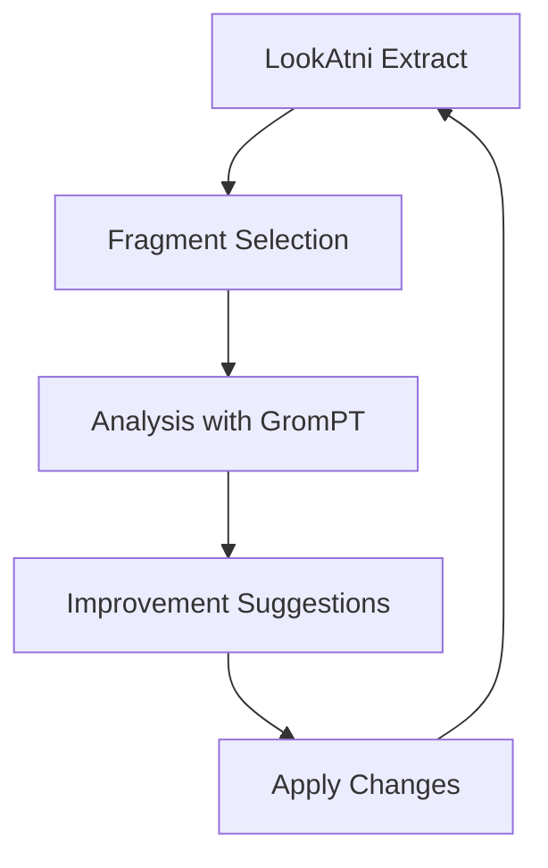

# LookAtni Direct Integration - Frontend

## Overview

O **LookAtni Direct Extractor** permite extrair e analisar código diretamente no browser, sem precisar de chamadas para o backend! Esta é uma integração mais elegante que roda o LookAtni como uma biblioteca Node.js no frontend.

## Features

### 🎯 **Client-Side Processing**

- Extração de projetos diretamente no browser
- Processamento de arquivos usando FileReader API
- Suporte para seleção de pastas e arquivos múltiplos
- Zero dependência do backend para extração básica

### 🧩 **Code Fragment Analysis**

- Extração automática de funções, classes, interfaces, componentes
- Detecção de imports/exports
- Análise de linguagens: JS, TS, Go, Python, Java, C++, PHP, Ruby, etc.
- Filtros por tipo, linguagem e busca textual

### 📦 **Archive Generation**

- Criação de arquivos navegáveis em HTML
- Download de archives ZIP com estrutura do projeto
- Metadados completos do projeto (estatísticas, linguagens, etc.)

### 🎨 **UI/UX Features**

- Interface responsiva com modo escuro
- Animações com Framer Motion
- Seleção múltipla de fragmentos
- Preview em tempo real dos fragmentos de código

## How to Use

### 1. **Mode Selection**

No `ProjectExtractor`, agora temos 3 modos:

- **Direct Extraction**: Nova funcionalidade - processamento client-side
- **Preview Mode**: Modo legado de preview
- **Download Mode**: Modo legado de download

### 2. **File Selection**

```jsx
// Select entire folder
<button onClick={selectFolder}>Select Folder</button>

// Select multiple files
<button onClick={selectFiles}>Select Files</button>
```

### 3. **Processing**

O processamento acontece automaticamente após a seleção:

- Leitura dos arquivos via FileReader
- Análise de linguagem por extensão
- Extração de fragmentos via regex patterns
- Construção da estrutura do projeto

### 4. **Fragment Browser**

```jsx
// Filter fragments
- Type: function, class, interface, component, etc.
- Language: javascript, typescript, go, python, etc.
- Search: text search in fragment names

// Select fragments
- Click to select/deselect
- "Use Selected for Analysis" to pass to analysis
```

### 5. **Archive Download**

```jsx
// Download navigable archive
<button onClick={downloadArchive}>Download Archive</button>
```

## Implementation Details

### Core Functions

```javascript
// Extract project from FileList
const extractProjectFromFiles = async (fileData: Map<string, File>)

// Read file content
const readFileAsText = (file: File): Promise<string>

// Language detection
const getLanguageFromExtension = (extension: string): string

// Fragment extraction
const extractFragmentsFromContent = (content: string, filePath: string, language: string)

// Archive creation
const createProjectArchive = async (project: ExtractedProject): Promise<Blob>
```

### Supported File Types

```javascript
const codeExtensions = [
  '.js', '.ts', '.jsx', '.tsx',     // JavaScript/TypeScript
  '.go',                            // Go
  '.py',                            // Python
  '.java',                          // Java
  '.cpp', '.c', '.h',               // C/C++
  '.php',                           // PHP
  '.rb',                            // Ruby
  '.rs',                            // Rust
  '.swift',                         // Swift
  '.kt', '.scala',                  // Kotlin/Scala
  '.cs', '.vb', '.fs',              // .NET languages
  '.html', '.css', '.scss',         // Web
  '.json', '.xml', '.yaml',         // Data
  '.md', '.txt', '.rst'             // Documentation
];
```

### Language Mapping

```javascript
const languageMap = {
  '.js': 'javascript',
  '.ts': 'typescript',
  '.jsx': 'javascript',
  '.tsx': 'typescript',
  '.go': 'go',
  '.py': 'python',
  // ... more mappings
};
```

## Integration Points

### 1. **With ProjectExtractor**

```jsx
<LookAtniDirectExtractor
  onFilesExtracted={(files) => {
    // Handle extracted files
    console.log('Files extracted:', files);
  }}
  onFragmentsSelected={(fragments) => {
    // Handle selected fragments for analysis
    console.log('Fragments selected:', fragments);
  }}
/>
```

### 2. **With Analysis Pipeline**

```jsx
// Pass extracted fragments to analysis
const selectedFragments = fragments.filter(f => selectedIds.has(f.id));
analysisService.analyzeFragments(selectedFragments);
```

### 3. **With Kanban Integration**

```jsx
// Drag fragments to Kanban boards
const handleFragmentDrop = (fragment, columnId) => {
  kanbanService.addFragmentToColumn(fragment, columnId);
};
```

## Browser Compatibility

### Required APIs

- **FileReader API**: Para leitura de arquivos
- **Blob API**: Para criação de archives
- **URL.createObjectURL**: Para downloads
- **webkitdirectory**: Para seleção de pastas (Chrome/Edge)

### Fallbacks

- Graceful degradation para browsers sem suporte a `webkitdirectory`
- Fallback para seleção de arquivos múltiplos
- Error handling para APIs não suportadas

## Future Enhancements

### 1. **WebAssembly Integration**

```javascript
// Use LookAtni compiled to WASM for better performance
const wasmLookatni = await import('lookatni-wasm');
const result = wasmLookatni.extractProject(files);
```

### 2. **Web Workers**

```javascript
// Process large projects in background
const worker = new Worker('lookatni-worker.js');
worker.postMessage({ files, options });
```

### 3. **Advanced Parsers**

- Tree-sitter integration for precise syntax analysis
- LSP integration for semantic analysis
- AST-based fragment extraction

### 4. **Real-time Collaboration**

- Share extracted projects via WebRTC
- Collaborative fragment selection
- Real-time code navigation

## Performance Considerations

### Memory Management

- Process files in chunks for large projects
- Use streaming for large file processing
- Clean up object URLs after use

### UI Responsiveness

- Use requestAnimationFrame for large UI updates
- Debounce search and filter operations
- Virtual scrolling for large fragment lists

### Error Handling

- Graceful degradation for unsupported files
- Progress indicators for large operations
- Clear error messages and recovery options

## Meta-Recursivity with GromPT

### Analysis Flow



### Integration Example

```javascript
// Meta-recursive improvement cycle
const improveProject = async (project) => {
  // 1. Extract with LookAtni
  const fragments = await extractFragments(project);

  // 2. Analyze with GromPT
  const analysis = await grompt.analyze(fragments);

  // 3. Apply improvements
  const improved = await grompt.improve(analysis);

  // 4. Re-extract and validate
  const newProject = await extractFragments(improved);

  return newProject;
};
```

---

**Esta implementação transforma o analyzer em uma ferramenta completamente autossuficiente para análise de código, rodando diretamente no browser com o poder do LookAtni!** 🚀✨
