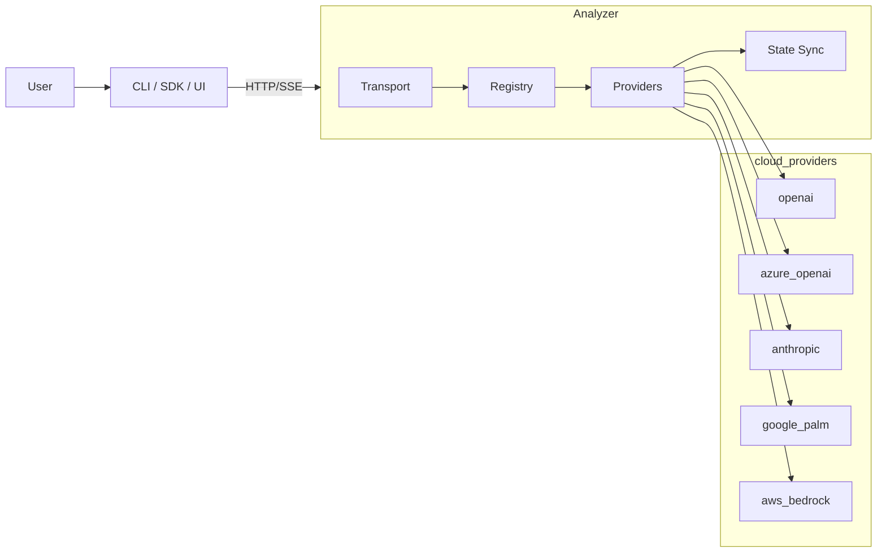

# Architecture Overview

O GemX Analyzer é um gateway + orquestrador com adapters por provider e transporte SSE sólido.



## Pastas

- `internal/providers/*` — adapters finos por vendor
- `internal/registry` — carrega `config.example.yml`, resolve provider
- `internal/transport` — HTTP/SSE, state sync, auth passthrough
- `cmd/main.go` — CLI (subcomando `gateway`)

## Fluxo SSE

```puml
POST /v1/chat ──► Provider.Chat(ctx, req) ──► stream
                                  ▲
                            BYOK só aqui
```

## State Sync (LWW + ETag)

- `PUT/POST /v1/state/export` com `If-Match`/`etag`
- `GET /v1/state/import` retorna versão + payload

Simples, testável, portável — ideal para multi-tenant com BYOK e quotas.
